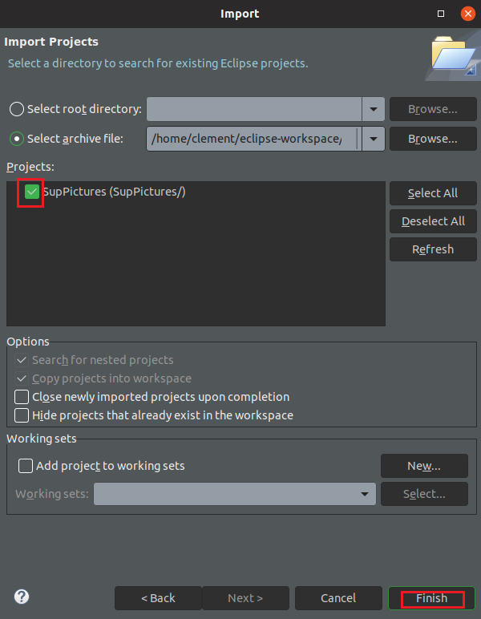
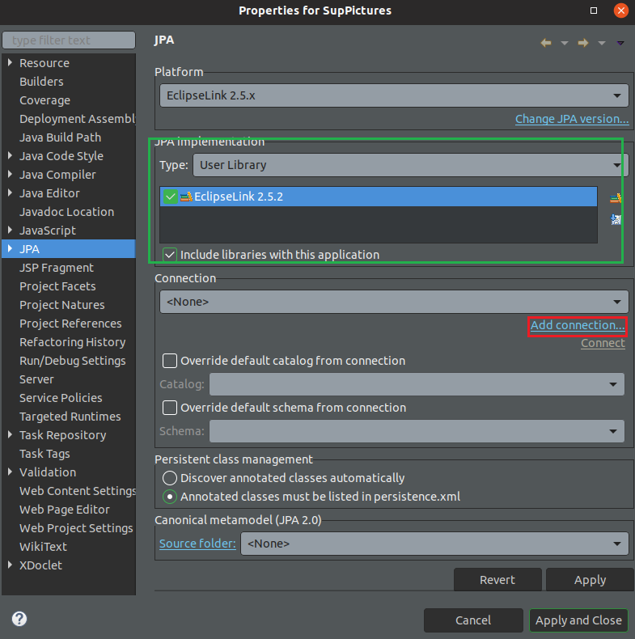
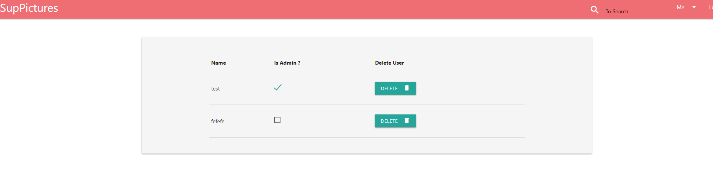

# JEE project release for 3JAV course

Voici la documentation pour le [projet SupPictures](./3JVA-Project-SupPictures.pdf). 

Ce projet utilise le responsive design !

Groupe : 
- 293042 : Robin Pierrat
- 295114 : Axel Kimmel
- 292621 : Clément Teyssandier

## Sommaire

0. Installation
1. Structure de données
2. La page d'index
3. L'enregistrement et l'authentification
4. Moteur de recherche
5. Photo
6. Web Service
7. Pages de profil
8. Déconnexion
9. Pannel administrateur

## 0. Installation

Vous aurez besoin au préalable d'une base de données MySQL, ainsi qu'un serveur TomCat.
Les instructions d'installations sont pour utiliser ce projet via Eclipse.

Vous devez tout d'abord importer le projet, pour celà, veuillez suivre les instructions données via les captures d'écran suivantes.

Si il y a toujours une erreur, copier la ligne si dessous, supprimez la, puis collez la.

Vous devriez ne plus avoir d'erreurs.

Il faut ensuite ajouter une connection à la base de données, puis générer les tables grâce aux entitées.

Vous devriez déjà avoir un ORM de selectionné (carré vert), sinon référez vous à [cet magnifique documentation](https://docs.google.com/document/d/1GN3_Wsf1v6Chzhc_nopwWvhdhu_tvkuXl6PepB9ItzU/edit?usp=sharing)

Petites astuces pour un meilleur fonctionnement :
- il est préférable d'utiliser le navigateur internet d'éclipse pour un bon affichage des images
- le dossier qui stock les images sera à la racine de C:\ mais on peut le changer si besoin

## 1. Structure de données

Nous avons représenté la structure de données de notre application via un diagramme UML.

## 2. La page d'index

La page d'accueil donne des informations sur le nombre de **personnes inscrites**, le nombre de **photos publiées**. 
Elle nous permet également de voir une **liste de photos publiées** sur SupPictures.

## 3. L'enregistrement et l'authentification

Une personne peut s'enregistrer sur le site en cliquant sur ``Register`` dans le menu de navigation.

Dans cette page, des informations personnelles doivent être renseignées. 
Il peut y avoir plusieurs utilisateurs avec le même email. 
Cependant ils ne peuvent pas avoir le même username.
Le premier utilisateur qui s'enregistre aura le rang administrateur.

Un utilisateur enregistré peut ensuite se connecter au site en cliquant sur ``Login`` dans le menu de navigation.

L'utilisateur doit ensuite renseigner son nom d'utilisateur, ainsi que sont mot de passe pour se connecter.

Les pages qui doivent être accessibles uniquement pour les utilisateurs authentifiés sont sous un filtre ``auth``, ce qui donne des urls tel que ``url/auth/----``.

## 4. Moteur de recherche

Il est possible de rechercher des photos par leur nom, description, la localisation de l'utilisateur qui l'a publiée ou par la catégorie auquel il appartient.
Ces recherches peuvent être faites par la barre située dans la barre de navigation.

Cela affiche donc les photos correspondant à la recherche.

## 5. Photo

Quand on affiche une photo, on voit sont titre, sa description, sa date de publication, sa catégorie (si elle en a une), le nombre de vois qu'elle a été vue.

L'utilisateur qui a publié la photo peut également modifié les éléments de la photos, ou la supprimer.
Cela en cliquant sur ``Me``, puis sur ``MyPicture``.

## 6. Web Service

Non implémenté.

## 7. Pages de profil

Pour accéder à son profil, un utilisateur doit cliquer sur ``Me``, puis sur ``My Profile``, situé dans le menu de navigation.

Le profil permet à un utilisateur d'accéder aux informations de son profil, ainsi que les modifier. Cependant, un autre utilisateur ne peut pas voir le profil d'un autre utilisateur.

## 8. Déconnexion

Chaque personne connectée, administrateur ou non, peut se déconnecter en cliquant le bouton ``Log Out``, situé dans le menu de navigation. Cela détruit sa session et il sera obligé de se reconnecter pour y accéder de nouveau.

## 9. Pannel administrateur

La partie administration est sécurisée par un filtre sur les urls ``/admin/*``. Il y a deux interfaces de gestion pour l'administrateur : l'interface de **gestion des utilisateurs** et l'interface de **gestion des photos**.

### 9.1 Gestion des utilisateurs

La gestion des utilisateurs est accessible via le menu de navigation sur ``Me``, puis ``Users``.

Une fois sur cette page, l'administrateur a la possibilité de voir quels utilisateurs sont également administrateur. 
Cette interface permet également de supprimer des utilisateurs.

### 9.2 Gestion des photos

La gestion des photos est accessible via le menu de navigation sur ``Me``, puis ``Pictures``.

Sur cette interface, l'administrateur voit les images, leurs noms et il est possible de les supprimer.

